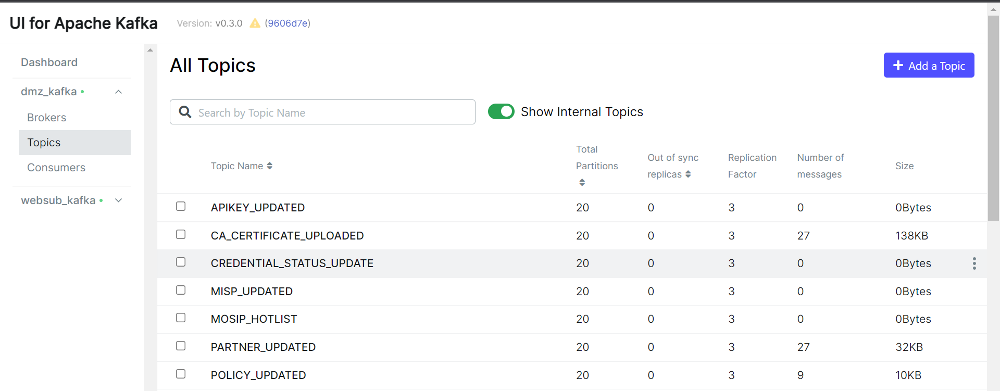
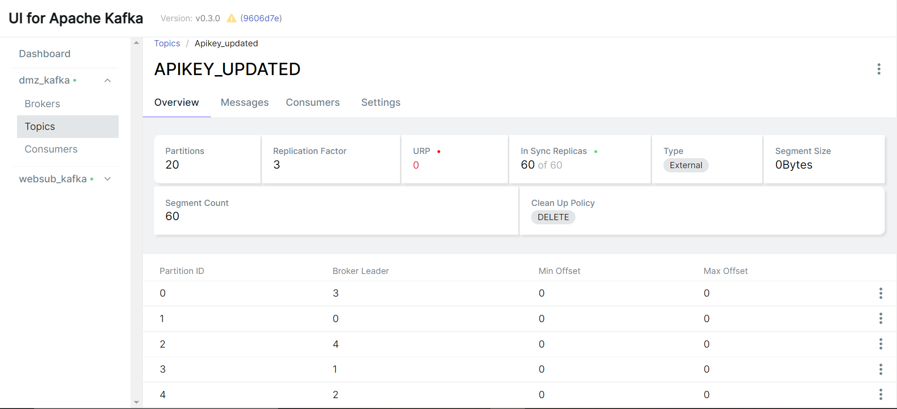

# Websub

## Overview
For an overview of Websub refer [MOSIP Docs](https://nayakrounak.gitbook.io/mosip-docs/modules/websub).

## Technical features
 - Ability to perform operations like register, publish, subscribe and unsubscribe
 - Ability to persist the state so that hub can be recovered even after a restart
 - Resume message delivery in case subscribers become unavailable and available again after some period of time
 - Gracefully handle transient message delivery failures between the the hub and the subscriber
 - Ability to authenticate and authorize hub operations such as publishing to hub, subscribing, unsubscribing, etc
 - Ability to scale seamlessly based on number of the subscribers

## Implementation
As mentioned above this implementation is based on Kafka message broker that does most of the heavy lifting.  At a high level following are the key components associated with this implementation.


An [IdP](https://en.wikipedia.org/wiki/Identity_provider) is used to handle any authentication and authorization request. For the other quality of services such as message persistence, subscription management, etc the implementation depends on Kafka message broker.

## Security
As mentioned above apart from standard SSL/TLS, for authentication and authorization the hub depends on an IdP.  OAuth2 is used as the authorization protocol along with JWT tokens.

## Usage

###  Starting Apache Kafka
Kafka should be present for this implementation. For running this locally download kafka and run the following commands to start the kafka broker.
```sh
./bin/zookeeper-server-start.sh config/zookeeper.properties
./bin/kafka-server-start.sh config/server.properties
```

To integrate any kafka(either local or remote) with hub following properties need to updated in both websub and consolidator service.

 - KAFKA_BOOTSTRAP_NODE

### Starting the IDP
After starting IDP and Auth service following properties need to updated in both websub service.

 - MOSIP_AUTH_BASE_URL
 - MOSIP_AUTH_VALIDATE_TOKEN_URL

### Starting the Consolidator Service
Once previous servers are up and running the Event Consolidator Service could be started. 

For local with Docker:

 - Pull consolidator [image](https://hub.docker.com/r/mosipdev/consolidator-websub-service) from dockerhub.
 - Run with the env variable `consolidator_config_file_url_env` which is the location of the property file.
 
For local with Docker:
 
 - Go into consolidator directory and run following command to built the project.
NOTE: ballerina should be present in your local system [(Download ballerina)](https://ballerina.io/downloads/)

 - Build:
    ```
    bal build
    ```

 - Execute project:
    ```
    bal run target/bin/consolidator.jar
    ```

### Starting the Hub
Run the hub using the following commands. Go into hub directory and run following command to built the project.

For local with Docker:

 - Pull websub [image](https://hub.docker.com/r/mosipdev/websub-service) from dockerhub.
 - Run with the env variable `hub_config_file_url_env` which is the location of the property file.
 
For local with Docker:
 
 -  Build:
    ``` 
     cd hub/
     bal build
    ``` 
 - Run
    ``` 
    bal run target/bin/hub.jar
    ``` 

After all prerequisites are completed [kernel-websubclient-api](https://github.com/mosip/commons/tree/master/kernel/kernel-websubclient-api) can be used for interactions with hub.

## Process

### Registering Topics
Registering a topic in hub with help of the client module. 

### Subscribing to the Hub:
Subscribe to the previously registered topic. Intent verification and content validation will be taken care by client itself.


### Publishing to the Hub:
Content publishing is a repeatative interaction between a publisher, hub and subscriber. Content will be validated based on hash which will be taken care by client provided.

## Debugging routes for Issues

  

***Few things to check after you start your setup***

  

**Kafka Connection**

  

  

After starting of hub it will create 4 topics in kafka for saving metadata for functionalities which will be used for which are following :

  

1. registered-websub-topics

2. consolidated-websub-topics

3. registered-websub-subscribers

4. consolidated-websub-subscribers

  

Please check this topics are there or not to verify connection to your kafka using command

  

kafka-topics.sh --list --bootstrap-server localhost:9092

  
  
  

***Few things to check If your subscriber is not able to receive messages***

  

- Check if your call has reach websub by checking logs . You can grep

for the line **grep "Running content update" | grep ${topic}**. If this exist websub has received you message and sent to kafka to store, Otherwise check the connectivity with websub by logs on client side about error.

  

- You can grep  "Error occurred while sending notification to subscriber" logs in websub logs if websub is not able to deliver to subscriber.

- Check if You are able to see exact same topic created like your in kafka

using the list command `kafka-topics.sh --list --bootstrap-server

localhost:9092 | grep <topic>.` or If you have kafka ui setup you can check in the Topics tab. If it doesn't exist check logs on websub side about any error connecting with kafka.

  



- Use the console consumer to check your message is associated to that topic or not, use command `kafka-console-consumer.sh --topic <topic> --from-beginning --bootstrap-server localhost:9092 | grep <timestamp>` or If you have kafka ui setup you can click on the topic to see the messages. If they doesn't exist check logs on websub side about any error connecting with kafka.

  



- Check if you are properly subscribed after subscription request hub sends a intent verification request to the subscriber callback using GET HTTP method. Please check if there are errors in intent verification on client side.

- Use the console consumer to check if your subscription is there in last index of json array in consolidated-websub-subscribers. `kafka-console-consumer.sh --topic consolidated-websub-subscribers --from-beginning --bootstrap-server localhost:9092` or If you have kafka ui setup you can click on the topic to see the messages . If doesn't exist please check if there are errors in intent verification on client side check logs on websub side about any error connecting with kafka.

- Describe your consumer group using the command `kafka-consumer-groups.sh --describe --group <group name> --bootstrap-server localhost:9092` or if you have kafka-ui you can check consumers in the tab Please check for the lag column if there is some lag. Your subscriber might return Http Status except 200 while delivering message which hub considers as non delivery and it retry to do that a configurable amount of time after that it stops and remove subscriber from hub cache making it as invalid subscriber and closing the consumer. Hub will not go to the next message until the previous one is delivered because of at least once delivery mechanism. Please resolve that ,resubscribe and send websub 200 as it will deliver all of your messages with the failed one once it can go ahead.


