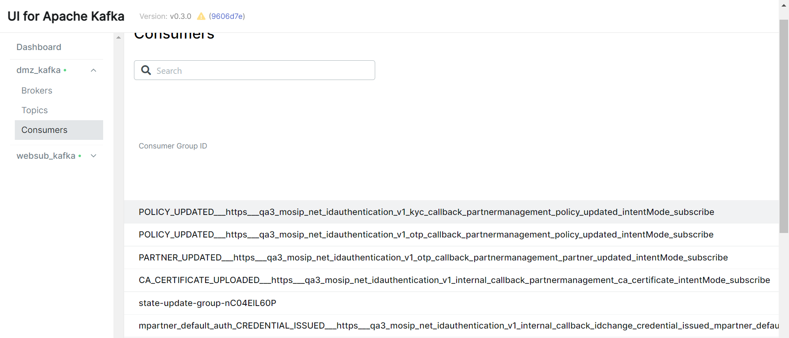

# Websub

## Overview
For an overview of Websub refer [MOSIP Docs](https://nayakrounak.gitbook.io/mosip-docs/modules/websub).

## Technical features
 - Ability to perform operations like register, publish, subscribe and unsubscribe
 - Ability to persist the state so that hub can be recovered even after a restart
 - Resume message delivery in case subscribers become unavailable and available again after some period of time
 - Gracefully handle transient message delivery failures between the the hub and the subscriber
 - Ability to authenticate and authorize hub operations such as publishing to hub, subscribing, unsubscribing, etc
 - Ability to scale seamlessly based on number of the subscribers

## Implementation
As mentioned above this implementation is based on Kafka message broker that does most of the heavy lifting.  At a high level following are the key components associated with this implementation.


An [IdP](https://en.wikipedia.org/wiki/Identity_provider) is used to handle any authentication and authorization request. For the other quality of services such as message persistence, subscription management, etc the implementation depends on Kafka message broker.

## Security
As mentioned above apart from standard SSL/TLS, for authentication and authorization the hub depends on an IdP.  OAuth2 is used as the authorization protocol along with JWT tokens.

## Usage

###  Starting Apache Kafka
Kafka should be present for this implementation. For running this locally download kafka and run the following commands to start the kafka broker.
```sh
./bin/zookeeper-server-start.sh config/zookeeper.properties
./bin/kafka-server-start.sh config/server.properties
```

To integrate any kafka(either local or remote) with hub following properties need to updated in both websub and consolidator service.

 - KAFKA_BOOTSTRAP_NODE

### Starting the IDP
After starting IDP and Auth service following properties need to updated in both websub service.

 - MOSIP_AUTH_BASE_URL
 - MOSIP_AUTH_VALIDATE_TOKEN_URL

### Starting the Consolidator Service
Once previous servers are up and running the Event Consolidator Service could be started. 

For local with Docker:

 - Pull consolidator [image](https://hub.docker.com/r/mosipdev/consolidator-websub-service) from dockerhub.
 - Run with the env variable `consolidator_config_file_url_env` which is the location of the property file.
 
For local with Docker:
 
 - Go into consolidator directory and run following command to built the project.
NOTE: ballerina should be present in your local system [(Download ballerina)](https://ballerina.io/downloads/)

 - Build:
    ```
    bal build
    ```

 - Execute project:
    ```
    bal run target/bin/consolidator.jar
    ```

### Starting the Hub
Run the hub using the following commands. Go into hub directory and run following command to built the project.

For local with Docker:

 - Pull websub [image](https://hub.docker.com/r/mosipdev/websub-service) from dockerhub.
 - Run with the env variable `hub_config_file_url_env` which is the location of the property file.
 
For local with Docker:
 
 -  Build:
    ``` 
     cd hub/
     bal build
    ``` 
 - Run
    ``` 
    bal run target/bin/hub.jar
    ``` 

After all prerequisites are completed [kernel-websubclient-api](https://github.com/mosip/commons/tree/master/kernel/kernel-websubclient-api) can be used for interactions with hub.

## Process

### Registering Topics
Registering a topic in hub with help of the client module. 

### Subscribing to the Hub:
Subscribe to the previously registered topic. Intent verification and content validation will be taken care by client itself.


### Publishing to the Hub:
Content publishing is a repeatative interaction between a publisher, hub and subscriber. Content will be validated based on hash which will be taken care by client provided.

## Trobleshoot guide

1. Kafka Connection

Hub creates following topics in kafka.

```
1. registered-websub-topics

2. consolidated-websub-topics

3. registered-websub-subscribers

4. consolidated-websub-subscribers
```
  

Please verify this topics are present with single partition in kafka using this command.

  
```
kafka-topics.sh --list --bootstrap-server localhost:9092 | grep {topic}

(Alternate : use kafka-ui)
```

 
  
  

2. Subscriber is not able to receiveing messages

   Follow this checklist with debug level enabled for possible cause and solution.  

- Successfull publish call

   ```
   grep "Received publish message" | grep ${topic} 
   ```

   Upon no entry check the connectivity with websub by logs on client side.

- Sucessfull subscription

   ```
   kafka-console-consumer.sh --topic consolidated-websub-subscribers --from-beginning --bootstrap-server localhost:9092
   
   (Alternate : use kafka-ui)
   ```
   Last index of json array has all active subscribers. In case no subscriber found check for errors in intent verification on client side.

- Request flow

   ```
   grep ${callback} | grep ${topic} 
   ```

   Check for any errors in the flow.

- Invalid Subscriber

   ```
   kafka-consumer-groups.sh --describe --group <group name> --bootstrap-server localhost:9092

   (Alternate : use kafka-ui)
   ```
   

   Check lag column. If lag exist subscriber might return Http Status except 200 while delivering message which hub considers as non delivery and it retries for a configurable amount of time after that it removes subscriber from hub cache making it as inactive subscriber and closing the consumer. Hub will not deliver next message as it follows at least once delivery mechanism. 
   
   Solution

   Please resolve subscribers and resubscribe.


